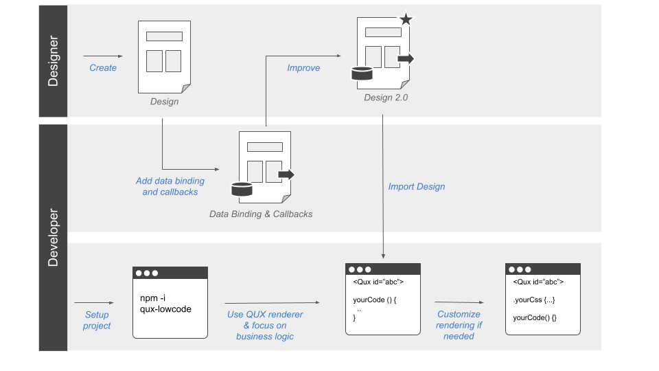
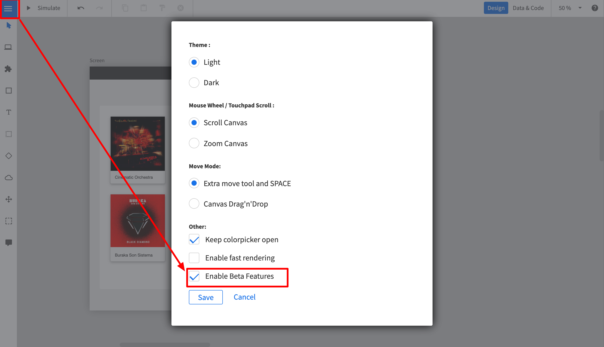

# QUX-LowCode
Quant-UX (http://www.quant-ux.com) is an OpenSource UX tool for the design and test of user interfaces. The QUX-LowCode package
provides a new approach to the hand-off problem (See details below). The core of the solution is the QUX component,
which renders the visual design and allows the developers to focus on business logic, without restricting the developers' freedom. The component enables:

1. Zero Code rendering of visual design and animations
2. Clear separation of UI and business logic
3. Developers can focus on code
4. Developers can use the tools and frameworks of their choice.
5. Designers can use the powerful visual design tool
6. Easy extension with custom callback functions
7. Full support of VUE data binding.
8. Extension with custom components
9. Extension with custom CSS
10. Rich library of stylable components.

## The handoff problem
Designers and developers use different tools to build user interfaces. Once a designer has completed the interface design, he hands-off the design to the developer, usually in the form of an image and some specs. 
The developer has now to rebuild the entire design using the programming language of his choice. 
Although this process is proven, it is rather slow and not very efficient. In particular later changes in 
the design makes it hard to automize this work through code generation tools.

## Envisioned workflow

We envision the following workflow to enable painless collaboration between designers and developers:



1. The designer creates an initial design in Quant-UX
2. The developer adds data binding and method callbacks in Quant-UX using a dedicated view.
3. The developer sets up a new project (Vue.js for now) and includes the QUX component
4. The developer loads the design from Quant-UX and creates the required methods and fills them with business logic.
5. The QUX component renders the design and invokes the callbacks in clicks.
6. Changes in the design are transparent to the developer, he just reloads the design from Quant-UX.


# How to use qux-lowcode

First, you have to install the QUX-LowCode package via NPM

```
npm i qux-lowcode
```

Second, you have to globaly import the QUX component

```
import Vue from "vue";
import QUX from 'qux-lowcode'
Vue.use(QUX);
```

## Place the QUX component.

Now you can start including the component, for instance in your home components. You have to pass your Quant-UX prototype
to the component, so it knows what to render. You can either pass a **javascrit object** or a **share key**

```
<QUX :app="app"/>
```

```
<QUX :debug="sharekey"/>
```

You can optain the share key from the http://quant-ux.com website by clicking share in the canvas menu. In general the share key is best for development. Updates in Quant-UX will be immediatly visible after a page reload. However, for production you should pass an app
object. You can download the app json with the following command:

```
tbd
```

Please note that home component should be wrapped by a router-view, otherwise navigation will not work. If you use VUE-CLI to bootrap the project, everything will be configured out of the box.

```
 <div id="app">
    <router-view/>
  </div>
```

## Update Router

Last, you have to update your router to delegate all routes to home. 

```
const routes = [
  {
    path: '/',
    name: 'home',
    component: () => import(/* webpackChunkName: "about" */ '../views/Home.vue')
  },
  {
    path: '/:screenName.html',
    name: 'qux',
    component: () => import(/* webpackChunkName: "about" */ '../views/Home.vue')
  }
]
```

The default paramter QUX will look for is 'screenName'. 

## Configure qux-lowcode

You can configure certain parameters, e.g. the routing rules. To do so, pass a config object to the 
qux component.

```
<QUX :app="app":config="config"/>
```

The config object can have the following properties and hsould be defined in the data section of the home component.

```
    config: {
        css: {
          grid: true, // Use CSS grid to align objects. False will use CSS-Flex.
          justifyContentInWrapper: true // In justifz or left align content in wrapped elements
        },
        router: {
          key: 'id', // alternative routing parameter
          prefix: 'qux' // path prefix that will be used when rendering links
        }
    }
```


## Data Binding

QUX-LowCode supports VUE data binding. You have to pass a v-model to the QUX component. The databindings for the
widgets must be defined in the Quant-UX canvas.

```
<QUX :app="app" v-model="payloud"/>
```

## Method Binding

In the Quant-UX canvas you can define javascript callbacks for the widgets. Place the methods in the parent compoent of QUX. The method will have the following signature:

```
myMethod (value, element, e) {
 ...
}
```

## MDI Icons

If you are using the Quant-UX icons components, you have to install the mdi-font package.

```
npm install @mdi/font
```

Afterwards import the icons in the App.vue

```
import '@mdi/font/css/materialdesignicons.css'
```

# Define data binding and callbacks in Quant-UX.

You can define the data binding and the callbacks in the normal Quant-UX designer. Before you start,
you have to enable the Beta features. To do so:

1. Login at http://www.quant-ux.com
2. Open the prototype
3. Click on the menu and select settings
4. Select "Enable Beta Features"
5. In the upper right corner you can now toggle between "Design" and "Data & Code" view



To set the code properties perform the following steps:

1. Click on "Data & Code" in the upper right corner
2. The canvas will turn gray now.
3. Select a widget. 
4. In the properties panel you can now define method name to be called.
5. If the widet supports data binding, you can also configure the data binding variable 
here. Please note, that Quant-UX supports JSON Path, so a variable name can be "person.name"


# Examples
https://github.com/KlausSchaefers/qux-low-code-example


# Dev Setup

```
npm install
```

Build:
```
npx bili --bundle-node-modules
```